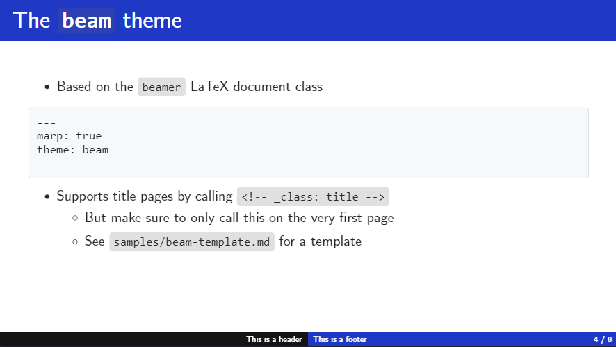
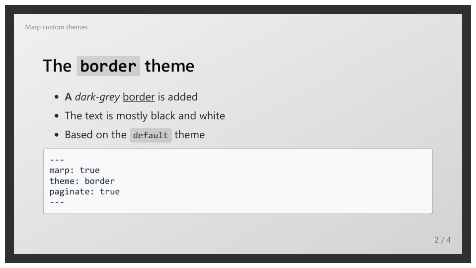
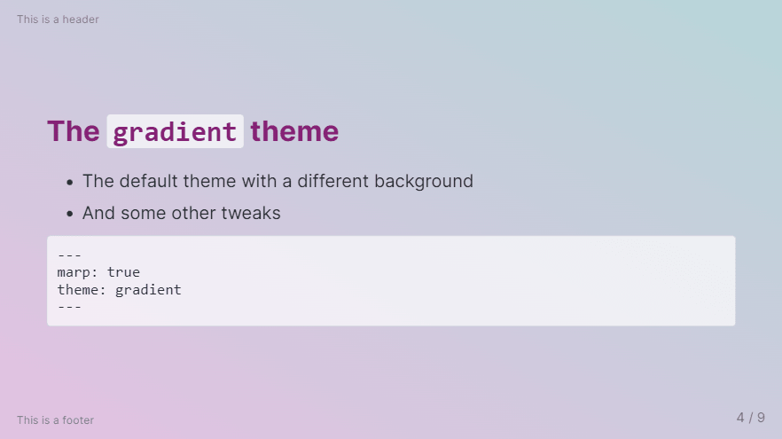
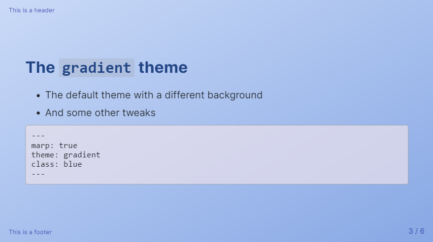

# My custom Marp themes

[Marp](https://marp.app/) is used to create presentations in Markdown. In this repository, you may find simple CSS themes that I have created. Namely:

## `beam`

````
https://raw.githubusercontent.com/rnd195/my-marp-themes/live/beam.css
````

- based on [LaTeX's beamer class](https://github.com/josephwright/beamer)

- download the [Computer Modern Unicode font family](https://ctan.org/pkg/cm-unicode?lang=en) for best results
- follow the [tutorial](how-to/beam_custom.md) to change the primary colors
- more screenshots on the [community themes website](https://rnd195.github.io/marp-community-themes/theme/beam.html)



## `border`

```
https://raw.githubusercontent.com/rnd195/my-marp-themes/live/border.css
```

- based on the `default` Marp theme

- find more screenshots on the [community themes website](https://rnd195.github.io/marp-community-themes/theme/border.html)




## `gradient`

```
https://raw.githubusercontent.com/rnd195/my-marp-themes/live/gradient.css
```

- also based on the `default` Marp theme

- more screenshots available on the [community themes website](https://rnd195.github.io/marp-community-themes/theme/gradient.html)




- `gradient`, class `blue`



## `graph_paper`

```
https://raw.githubusercontent.com/rnd195/my-marp-themes/live/graph_paper.css
```

- click [here](https://rnd195.github.io/marp-community-themes/theme/graph_paper.html) to see more screenshots


# Installation

Assuming you're using the VSCode Marp extension…

1. Open Settings in VSCode (`Ctrl + ,`)
2. Search for "Marp: Themes" or "markdown.marp.themes"
3. Add either a local or a remote path to the CSS file
   - e.g.: https://raw.githubusercontent.com/rnd195/my-marp-themes/live/theme_name.css
4. Enable the theme in the front-matter of the Markdown document, i.e., write the following at the very beginning of the Markdown document:

```
---
marp: true
theme: theme_name
---
```

5. Try restaring VSCode if it doesn't work right away

For additional settings (such as `size` or `paginate`), follow the [official documentation](https://github.com/marp-team/marp/blob/main/website/docs/guide/directives.md).

# License

The `beamer`-inspired `beam` theme is licensed under [GNU GPLv3](https://github.com/rnd195/my-marp-themes/blob/main/LICENSE_beamer). The rest of the repository is licensed under the [MIT License](https://github.com/rnd195/my-marp-themes/blob/main/LICENSE).


## Attribution

The `beam`, `border`, `graph_paper`, and `gradient` themes are based on the `default` Marp themes made by [yhatt](https://github.com/marp-team/marp-core/tree/main/themes). The `border` and `gradient` themes import the [Inter](https://fonts.google.com/specimen/Inter) font by [Rasmus Andersson](https://rsms.me/). The `graph_paper` theme imports the [Work Sans](https://github.com/weiweihuanghuang/Work-Sans) font by [Wei Huang](https://github.com/weiweihuanghuang).

