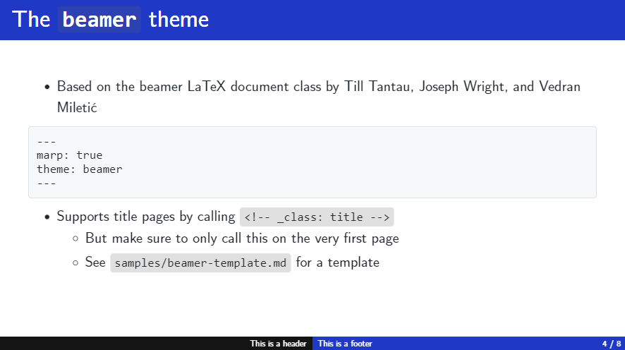

# My custom Marp themes

[Marp](https://marp.app/) is used to create presentations in Markdown. In this repository, you may find simple CSS themes that I have created. Namely:

- `beamer`, based on [LaTeX's beamer class](https://github.com/josephwright/beamer)
  - download the [Computer Modern Unicode font family](https://ctan.org/pkg/cm-unicode?lang=en) for best results

- `border`, based on the `default` Marp theme

- `gradient`, also based on the `default` Marp theme

- `gradient`, class `blue`

## Installation

Assuming you're using the VSCode Marp extension… In VSCode, open

- Preferences: Open Settings (UI)
- Search for "Marp: Themes"
- Add either a local or a remote path
  - e.g.: https://raw.githubusercontent.com/rnd195/my-marp-themes/main/border.css
- Try restaring VSCode if it doesn't work right away

- Then in the Markdown document, simply write, for instance, `theme: border` in the YAML

### License

The `beamer` theme is licensed under [GNU GPLv3](https://github.com/rnd195/my-marp-themes/blob/main/LICENSE_beamer). The rest of the repository is licensed under the [MIT License](https://github.com/rnd195/my-marp-themes/blob/main/LICENSE).

### Attribution

The `beamer`, `border`, and `gradient` themes are based on the `default` Marp themes made by [yhatt](https://github.com/marp-team/marp-core/tree/main/themes). The `border` and `gradient` themes import the [Inter](https://fonts.google.com/specimen/Inter) font by [Rasmus Andersson](https://rsms.me/).

