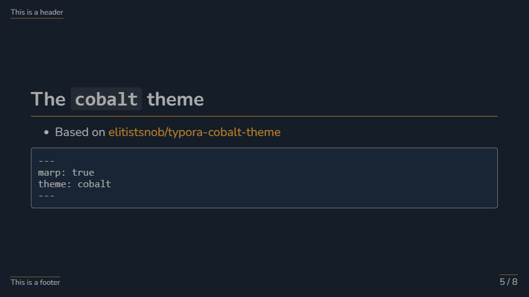

# My custom Marp themes

[Marp](https://marp.app/) is used to create presentations in Markdown. In this repository, you may find simple CSS themes that I have created. Namely:

- `beamer`, inspired by LaTeX's Beamer class
  - download the [Computer Modern Unicode font family](https://ctan.org/pkg/cm-unicode?lang=en) for best results

- `border`, based on the `default` Marp theme

- `gradient`, also based on the `default` Marp theme

- `gradient`, class `blue`

- `cobalt`, which is heavily based on [elitistsnob/typora-cobalt-theme](https://github.com/elitistsnob/typora-cobalt-theme)

## Installation

Assuming you're using the VSCode Marp extension… In VSCode, open

- Preferences: Open Settings (UI)
- Search for "Marp: Themes"
- Add either a local or a remote path
  - e.g.: https://raw.githubusercontent.com/rnd195/my-marp-themes/main/border.css
- Try restaring VSCode if it doesn't work right away

- Then in the Markdown document, simply write, for instance, `theme: border` in the YAML

Some of the themes are intended to be used with the [Inter](https://github.com/rsms/inter) font by [rsms](https://github.com/rsms/), so check them out.
